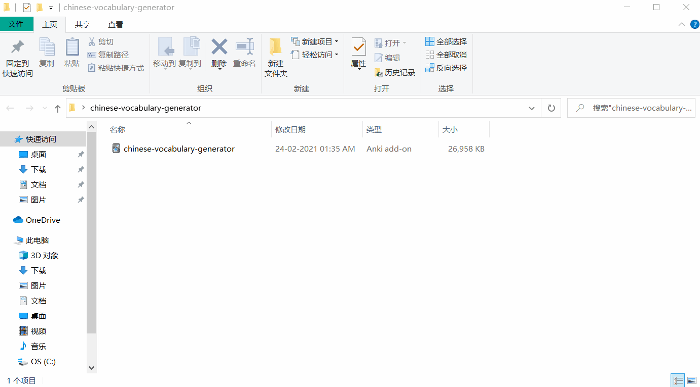

# Chinese-Vocabulary-Generator-Anki-Addon

Create Chinese vocabulary list with examples sentences and audio and notes data to Anki

## Download Online Version
[Download this Addon from AnkiWeb](https://ankiweb.net/shared/info/1370756741)

## Download Offline Version
[Download this Addon from GitHub](https://github.com/infinyte7/Chinese-Vocabulary-Generator-Anki-Addon/releases)

Note: The offline version have dictionary data and example sentences translation. But words not in cedict and audio files will be still fetched online.
But it will create notes instantly without audio.

Features
- Characters
    - Simplified
    - Traditional
    - Pinyin
    - Meanings
    - Audio
- Examples Sentences
    - Simplified
    - Traditional
    - Pinyin
    - Translation
    - Audio
- Two templates
    - Simple
    - Colorful
 More Templates will be added in next updates

## Demo

## License
[View License](License.md)